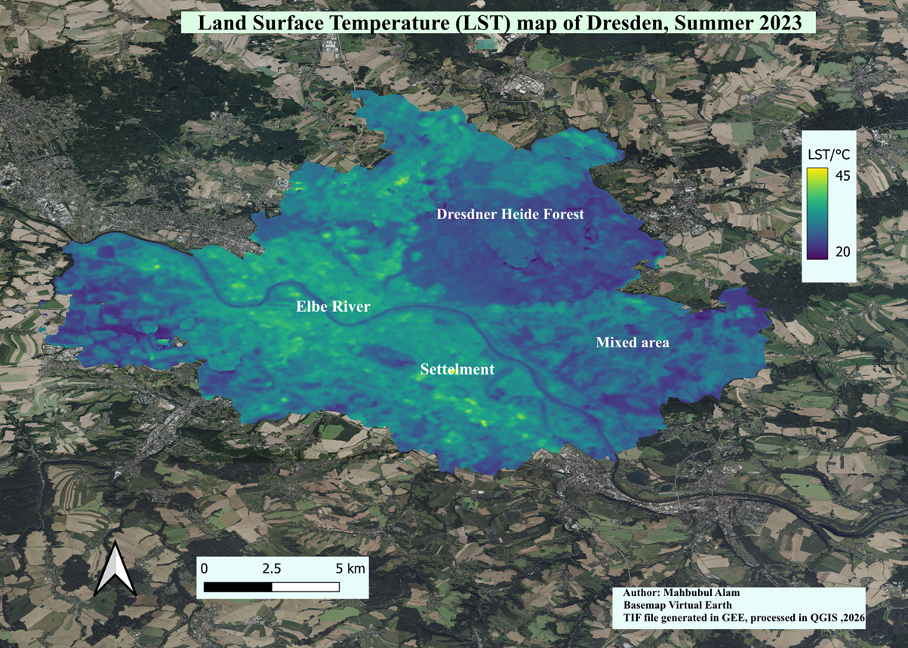
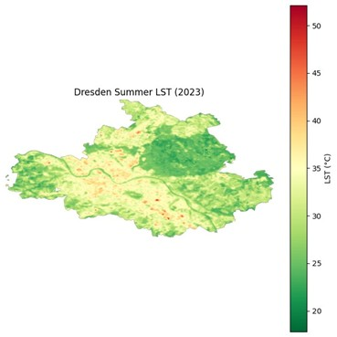
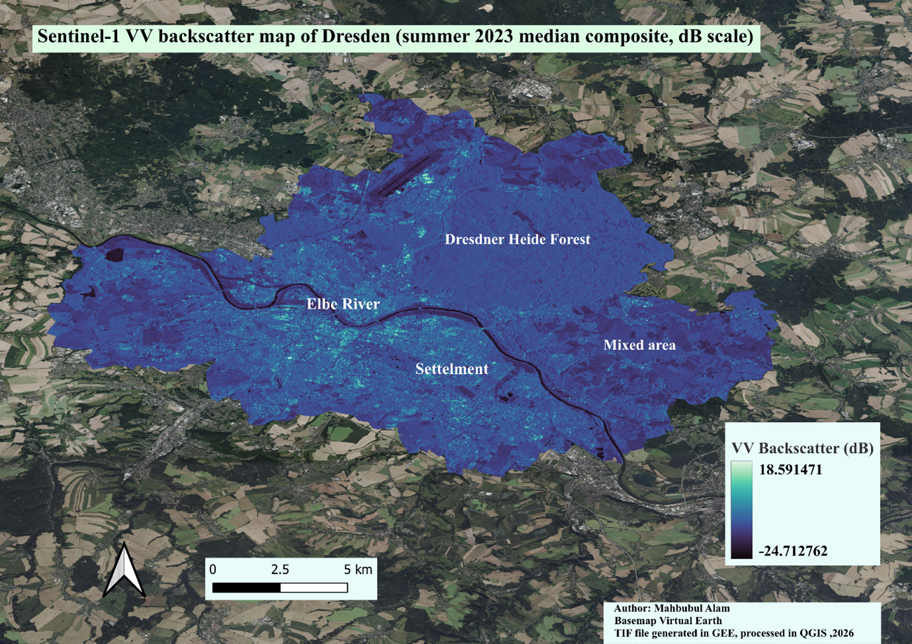
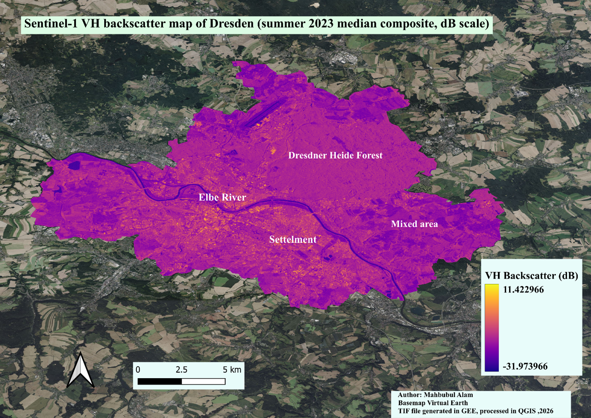
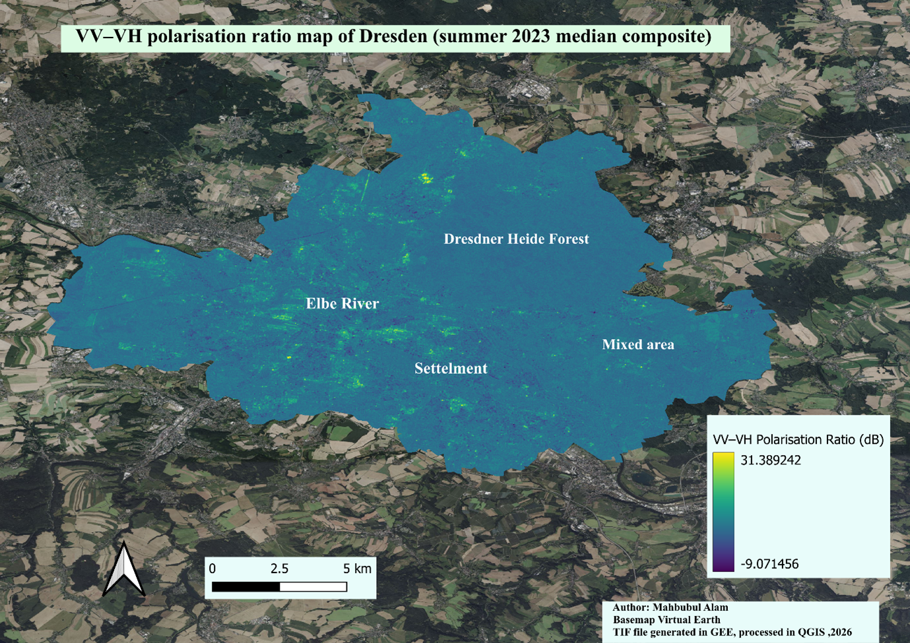
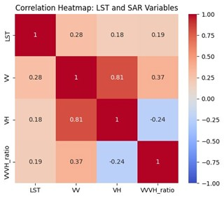
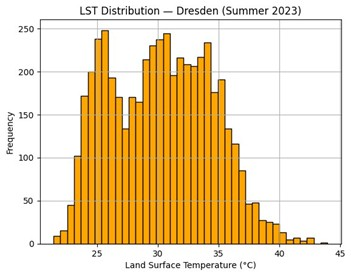
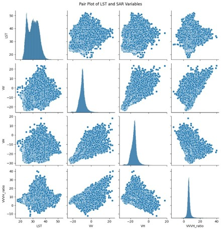

# Multi‑Sensor Analysis of Land Surface Temperature and Sentinel‑1 SAR Backscatter in Dresden, Summer 2023  
***Mahbubul Alam***

## 1. Introduction
Urban areas exhibit strong spatial variability in surface temperature due to differences in land cover, vegetation, and built‑up density. This study integrates **Landsat 8/9 Land Surface Temperature (LST)** with **Sentinel‑1 SAR backscatter (VV, VH, VV–VH ratio)** to analyse the thermal and structural characteristics of Dresden during the summer of 2023.

## 2. Literature Review
The review covers:
- Urban Heat Island processes  
- LST retrieval and interpretation  
- Sentinel‑1 SAR backscatter behaviour in urban environments  
- Integration of thermal and SAR datasets  

## 3. Study Area


**Figure 1:** Location of the Dresden study area used for LST and SAR analysis.

## 4. Data and Methods
### 4.1 Google Earth Engine Processing Framework
- Cloud masking  
- LST retrieval  
- VV, VH, and VV–VH ratio computation  
- Median seasonal compositing  

### 4.2 Python Analysis
- Raster alignment  
- Masking and stacking  
- Correlation analysis  
- Pair‑plot and histogram generation  

---

## 5. Results

### 5.1 Land Surface Temperature (LST)



**Figure 2:** LST map of Dresden (°C).

### 5.2 Sentinel‑1 VV Backscatter



**Figure 3:** VV backscatter (dB).

### 5.3 Sentinel‑1 VH Backscatter



**Figure 4:** VH backscatter (dB).

### 5.4 VV–VH Polarisation Ratio



**Figure 5:** VV–VH ratio (dB).

### 5.5 Pearson Correlation Matrix



**Figure 6:** Pearson correlation matrix.

### 5.6 LST Frequency Distribution



**Figure 7:** LST histogram.

### 5.7 Multivariate Pair Plot



**Figure 8:** Pair plot matrix of LST, VV, VH, and VV–VH ratio.

---

## 6. Highlighted Results

Figure 2–8 above summarize the key findings of the study:

- Spatial distribution of LST across Dresden  
- Structural differences captured by VV and VH backscatter  
- VV–VH ratio enhancing contrast between built‑up and vegetated areas  
- Correlation structure between thermal and SAR variables  
- Frequency distribution of LST  
- Multivariate relationships visualized through pair‑plots  

These visualizations provide a comprehensive understanding of how thermal and radar signals interact across different land‑cover types.

---

## 7. Notebook (Code) Files and Their Description

### **Main Notebook**
`MultiSensor_LST_SAR_Dresden_2023.ipynb`  
Includes:

- Importing and aligning Landsat LST and Sentinel‑1 SAR rasters  
- Masking and stacking  
- Computing VV–VH ratio  
- Statistical analysis  
- Correlation matrix  
- Pair‑plot and histogram generation  

### **Prerequisites**
```python
import ee
ee.Initialize(project='ProjectName')

## 8. Files Needed to Run the Code Externally

The following files are included in the repository and are required to reproduce the analysis:

- **Study_Area.shp** — boundary of Dresden used for clipping and spatial masking  
- **Exported GeoTIFFs** from Google Earth Engine — analysis‑ready LST, VV, VH, and VV–VH ratio rasters  
- **cor_point.csv** — dataset required for reproducing the correlation analysis  

These files ensure that the Python notebook can be executed outside Google Earth Engine with consistent results.

---

## 9. Remarks

This repository is created for academic and research purposes.  
If you use the workflow, figures, or code, please cite appropriately:

**Alam, M. (2026). Multi‑Sensor Analysis of Land Surface Temperature and Sentinel‑1 SAR Backscatter in Dresden, Summer 2023. ARSI Term Project, HNEE.**

